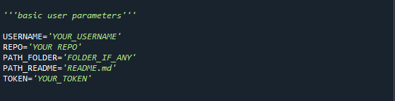

# README_table_generator
<h1>Pre-requisites</h1>
<h3>Libraries required :</h3>
<li>Requests (needs install) </li>
<li>json </li>
<li>base64 </li>
 
<h4>How to install 'requests':</h4>
<ul>
  <li><h5>For Windows:</h5> <b>python -m pip install requests</b></li>
  <li><h5>For Linux: </h5> <b>pip install requests</b></li>
</ul>
 
More information can be found on this <a href="https://www.geeksforgeeks.org/how-to-install-requests-in-python-for-windows-linux-mac/"> link</a>.
 
<h1>Getting Started</h1>
Few variables need to be replaced with your details before executing the program.
 
</img>
<ul>
  <li>USERNAME- replace with your github username </li>
  <li>REPO- replace with name of your repository </li>
  <li>PATH_FOLDER- this is optional if you have the content inside of any folder, if not leave as '' </li>
  <li>PATH_README- *need not be changed unless the name of the readme file has been modified  </li>
  <li>TOKEN- replace with your github token. How to get your personal token? check this <a href="https://docs.github.com/en/enterprise-server@3.9/authentication/keeping-your-account-and-data-secure/managing-your-personal-access-tokens">link</a> </li>

</ul>
 I highly recommend after generating your token, you check if its working or not by running the following command:-
  
  <li><b>curl -H "Authorization: token {TOKEN}" https://api.github.com/repos/{USERNAME}/{REPO}/contents/{PATH_FOLDER}</b></li> 
   
  It should return a json file listing the contents.
 
<h1>Execution</h1>
After modifying the variables, you are ready to run the program. 
The program should print <b>"Successful Update"</b> if everything has been executed successfully.
Otherwise, the program will print error message with corresponding error code.
 
<h3>Error Codes</h3>
Here's a <a href="https://www.restapitutorial.com/httpstatuscodes.html">list</a> of HTTP error codes and their meaning.
 
 
Open to all sorts of suggestions and feedback. Thanks!

